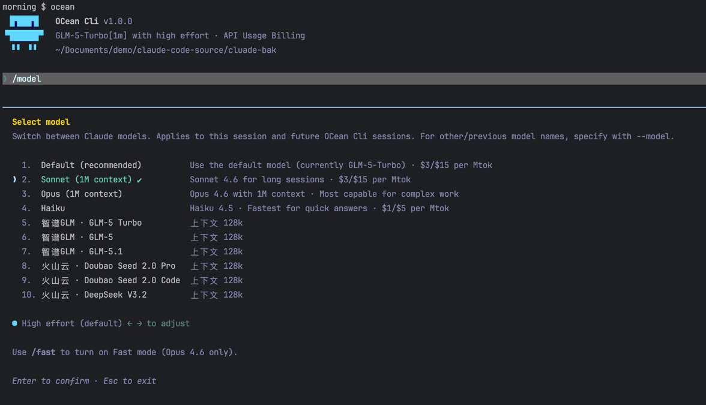

# Ocean CLI - 增强版 Claude 命令行工具
> 支持多AI提供商接入、一键模型切换的智能开发助手


## ✨ 核心特性

### 🎯 多模型提供商支持
- 原生支持 Claude 系列模型 (Opus/Sonnet/Haiku)
- 兼容第三方自定义模型 API 接入（智谱GLM、豆包、DeepSeek等）
- 一键 `/model` 命令切换模型提供商，无需手动修改配置
- 智能过载重试机制，自动处理API限流和超时问题


*一键切换10+不同提供商的AI模型，支持价格展示和上下文长度说明*

### ⚡ Auto Mode（自动模式）
- **`--permission-mode auto`** 或 **`--enable-auto-mode`**：启用 AI 分类器自动审批
- 安全操作（读文件、grep 等）自动批准，无需手动确认
- 危险操作（删除文件、执行 bash 命令等）仍需用户确认
- 支持所有模型提供商，不限制 Anthropic 官方模型
- 可在 `settings.json` 中设置默认模式：`"permissions": { "defaultMode": "auto" }`

```bash
# 命令行启用
ocean --permission-mode auto

# 或使用等效参数
ocean --enable-auto-mode

# 配置文件永久启用（~/.claude/settings.json）
{
  "permissions": {
    "defaultMode": "auto"
  }
}
```

> Ocean CLI 已解除原版 Claude Code 中 Auto Mode 的 TRANSCRIPT_CLASSIFIER feature gate 限制，所有模型和提供商均可使用。

### 🎨 海洋深蓝主题
- 全新设计的海洋深蓝UI主题，视觉舒适
- 优化的终端显示效果，支持代码高亮和格式化
- 响应式布局，适配不同终端尺寸

### 🧠 双层记忆系统
- **手动记忆** (`/mem` 命令)：管理项目知识片段，支持压缩总结和提炼式工作交接
- **自动记忆提取**：每次对话后后台自动分析并提取值得记住的信息（用户偏好、项目动态、行为反馈等），无需手动操作
- **AutoDream 整合**：每 24h + 5 个会话后自动去重、修剪、整合记忆，保持知识库精简准确
- **智能检索**：自动从记忆库中选择与当前查询相关的记忆注入上下文，附带新鲜度提醒

### 📡 Channel 系统（IM 集成）
- 通过 MCP 协议接入 IM 平台（钉钉、Telegram、飞书、Discord 等），远程控制 Agent
- 支持入站消息推送（用户通过 IM 发消息 → Agent 接收并执行）
- 支持 Agent 主动回复（Agent 调用 MCP 工具 → 消息发送到 IM）
- 权限中继：工具审批提示可转发到 IM，用户远程回复 "yes/no" 完成审批
- 六层安全门控：能力声明 → 运行时开关 → 认证 → 组织策略 → 会话白名单 → 插件白名单

```bash
# 启动时指定 Channel MCP 服务器
ocean --channels server:feishu-unofficial

# 开发模式（跳过白名单检查）
ocean --dangerously-load-development-channels server:feishu-unofficial
```

> **已验证平台**：飞书（[详细接入教程](docs/08-channel-feishu.md)） | 钉钉（[open-dingtalk/dingtalk-mcp](https://github.com/open-dingtalk/dingtalk-mcp)）

### 🔧 增强开发功能
- **智能Commit命令**：自动检测代码变更，生成符合Conventional Commits规范的提交信息
- **多Agent协作**：内置多种专业Agent，处理复杂任务、代码审查、架构设计等场景
- **技能扩展系统**：支持安装自定义技能，扩展CLI功能
- **会话持久化**：自动保存会话上下文，支持断点续接和工作交接

## 🚀 快速开始

### 安装
```bash
# 克隆项目
git clone https://github.com/your-repo/ocean-cli.git
cd ocean-cli

# 安装依赖
bun install

# 构建
./build.sh
```

### 基础使用
```bash
# 启动Ocean CLI
./ocean

# 切换模型
/model claude-opus-4-6

# 查看帮助
/help
```

## 📦 功能亮点

### 自定义模型接入
在项目根目录创建 `custom-providers.json` 文件，按照以下格式配置第三方模型提供商：

```json
{
  "provider-id": {
    "name": "提供商显示名称",
    "type": "anthropic", // 兼容Anthropic API格式的提供商使用此类型
    "baseUrl": "API端点地址",
    "apiKeyEnv": "API密钥或环境变量名",
    "models": [
      { "id": "模型ID", "name": "模型显示名称", "contextLength": 上下文长度 },
      { "id": "模型ID2", "name": "模型显示名称2", "contextLength": 上下文长度 }
    ]
  }
}
```

#### 配置示例：
```json
{
  "glm": {
    "name": "智谱GLM",
    "type": "anthropic",
    "baseUrl": "https://open.bigmodel.cn/api/anthropic",
    "apiKeyEnv": "你的智谱API密钥",
    "models": [
      { "id": "glm-5-turbo", "name": "GLM-5 Turbo", "contextLength": 128000 },
      { "id": "glm-5", "name": "GLM-5", "contextLength": 128000 }
    ]
  },
  "vk": {
    "name": "火山云",
    "type": "anthropic",
    "baseUrl": "https://ark.cn-beijing.volces.com/api/coding",
    "apiKeyEnv": "你的火山云API密钥",
    "models": [
      { "id": "doubao-seed-2.0-pro", "name": "Doubao Seed 2.0 Pro", "contextLength": 128000 },
      { "id": "deepseek-v3.2", "name": "DeepSeek V3.2", "contextLength": 128000 }
    ]
  }
}
```

### 智能重试机制
- 自动识别API过载错误，指数退避重试
- 无固定重试次数限制，直到请求成功或手动终止
- 友好的错误提示，帮助定位问题

### Commit命令增强
```bash
# 自动生成规范的commit信息
/commit

# 自定义提交信息
/commit "feat: 添加新功能"
```

### 轻量记忆系统
```bash
# 列出当前项目所有记忆片段
/mem

# 压缩总结当前对话为知识片段
/mem add [title]

# 提炼式工作交接，保留关键上下文（需求、决策、文件变更、待办）
/mem add --full [title]

# 查看指定片段完整内容
/mem show <id>

# 搜索记忆
/mem search <keyword>

# 删除记忆
/mem rm <id>
```

记忆按项目隔离存储在 `.claude/memory/` 下，新会话自动注入摘要列表，按需加载全文。

### 自动记忆提取
Ocean CLI 内置了双层自动记忆系统，无需手动操作即可持续积累项目知识：

- **extractMemories**：每次模型回复后，后台分叉代理自动分析对话，提取用户画像、行为反馈、项目动态等值得记住的信息，写入 `.claude/memory/`
- **AutoDream**：每隔 24 小时且积累 5 个新会话后，自动启动记忆整合——去重、修剪过时内容、压缩索引，保持知识库精简
- **智能检索**：用户提问时，系统自动从记忆库中选择最相关的记忆（最多 5 条）注入上下文，并附新鲜度提醒
- 四种记忆类型：`user`（用户画像）、`feedback`（行为反馈）、`project`（项目动态）、`reference`（外部引用）

> 自动提取采用保守策略，可能不会保存你认为有价值的内容。此时可用 `/mem add` 手动补充，或在对话中直接说"记住这个"。
- 可通过 `settings.json` 的 `autoDreamEnabled: false` 关闭 AutoDream

### 多模型协作
配置多个 AI 模型按角色分工协作处理任务，支持自定义 Provider（智谱GLM、火山云等）。

```bash
# 查看可用模型
/agent-config models

# 查看内置角色预设
/agent-config presets

# 用预设快速创建 agent
/agent-config preset architect --model glm:glm-5.1
/agent-config preset reviewer --model vk:doubao-seed-2.0-pro
/agent-config preset implementer --model glm:glm-5-turbo

# 查看已配置的 agent
/agent-config list

# 多模型协作（真实并行调用）
/multi-agent 帮我设计一个高并发缓存系统
```

配置默认保存到 `~/.claude/agents.json`（全局通用），加 `--local` 可保存到当前项目。支持 5 个内置角色预设：架构师、审查员、实现者、测试专家、DevOps 工程师。

## 🛠 开发指南

### 项目结构
```
├── src/                 # 主源码目录
│   ├── agents/          # Agent实现
│   ├── skills/          # 技能系统
│   ├── providers/       # 模型提供商接入
│   └── cli/             # 命令行界面
├── docs/                # 文档
├── shims/               # 兼容性垫片
├── vendor/              # 第三方依赖
└── static/              # 静态资源
```

### 构建项目
```bash
# 开发模式
bun dev

# 生产构建
./build.sh

# 运行测试
bun test
```

## 🤝 贡献指南

1. Fork 本仓库
2. 创建功能分支 (`git checkout -b feature/AmazingFeature`)
3. 提交更改 (`git commit -m 'feat: 添加一些很棒的功能'`)
4. 推送到分支 (`git push origin feature/AmazingFeature`)
5. 开启 Pull Request

## 📝 更新日志

### v1.0.0
- ✅ 完整品牌重命名为 Ocean CLI，采用海洋深蓝主题
- ✅ 支持第三方自定义模型API兼容性增强
- ✅ 增强commit命令功能，自动生成规范提交信息
- ✅ 新增 `/mem` 轻量级项目记忆命令，支持压缩总结和工作交接
- ✅ 新增 `/multi-agent` 多模型协作命令，支持自定义 Provider 按角色分工并行处理任务
- ✅ 新增 `/agent-config` 协作 Agent 配置管理，全局/项目级配置合并
- ✅ 实现自定义提供商过载重试机制
- ✅ 优化重试逻辑和错误提示
- ✅ 移除不必要的重试次数限制，提升可用性

### v1.1.0
- ✅ 启用 Channel IM 集成系统，支持通过钉钉/Telegram 等平台远程控制 Agent
- ✅ 解除所有 Channel 门控（feature flag、GrowthBook 远程配置、OAuth、白名单），本地工具完全可用
- ✅ 启用内置自动记忆提取（extractMemories），对话后后台自动保存记忆
- ✅ 启用 AutoDream 记忆整合，定期去重修剪保持知识库精简
- ✅ 修复 Bun 1.3.12 下 `@` 文件匹配失效问题（execa signal 兼容性）
- ✅ 修复 Ctrl+V 粘贴图片失败（`image-processor.node` 占位符未校验 + sharp libvips 动态库路径不匹配）

## 📄 许可证

本项目采用 MIT 许可证 - 查看 [LICENSE](LICENSE) 文件了解详情

## 🙏 致谢

- 感谢 Anthropic 提供的 Claude API
- 感谢开源社区的贡献者们

---

**Ocean CLI - 让AI开发更高效，更顺畅** 🚀

