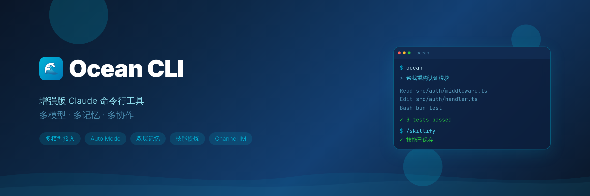
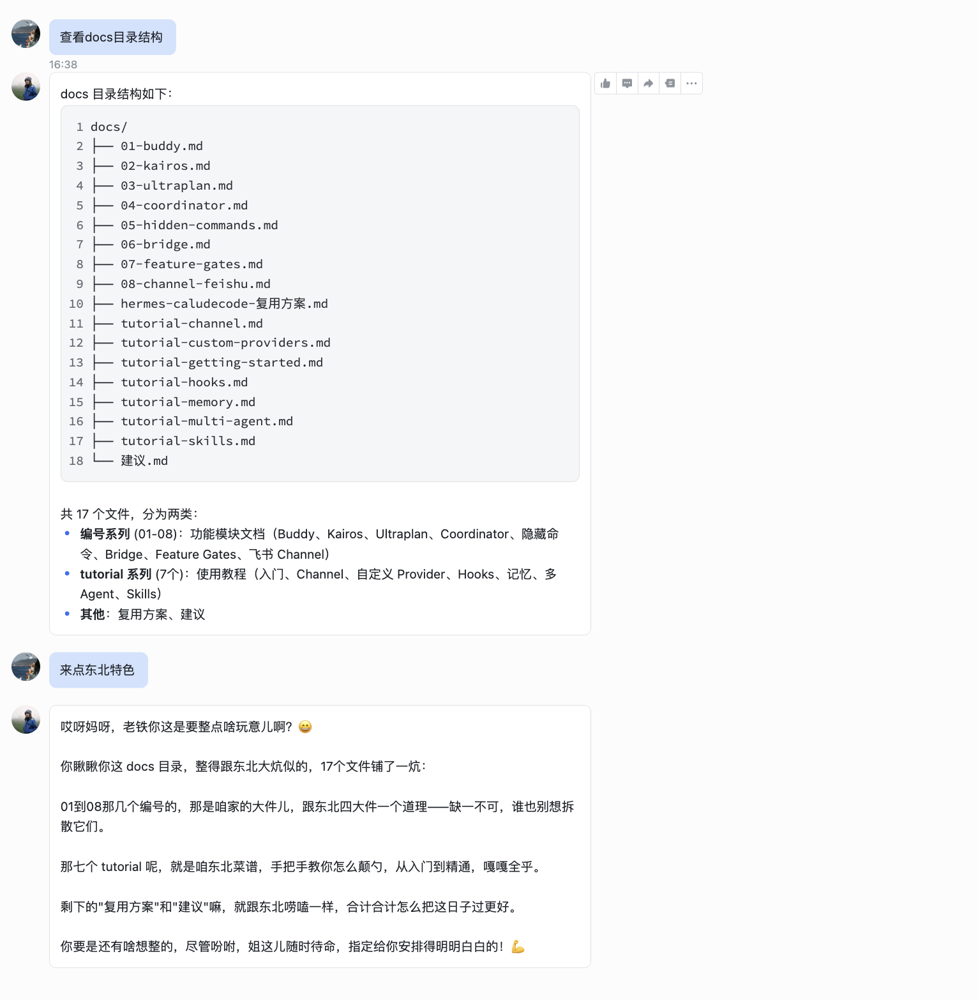

<p align="center">
  
</p>

<div align="center">

**增强版 Claude 命令行工具 — 多模型 · 多记忆 · 多协作**

</div>

<div align="center">

[](LICENSE)
[](README.md)

</div>

<p align="center">
  <a href="#核心功能">功能</a> · <a href="#快速开始">快速开始</a> · <a href="#教程目录">文档</a> · <a href="#架构参考">架构</a>
</p>

---

## 功能

- 完整的 Ink TUI 交互界面（与官方 Claude Code 一致）
- **多模型接入** — Claude / 智谱GLM / 豆包 / DeepSeek，`/model` 一键切换
- **Auto Mode** — AI 分类器自动审批安全操作，危险操作仍需确认
- **三层记忆系统** — `/mem` 手动记忆 + 自动提取 + AutoDream 整合 + 结构化事实存储（SQLite+FTS5） — [使用指南](docs/tutorial-memory.md)
- **多模型协作** — `/multi-agent` 按角色分工，真实并行调用 — [使用指南](docs/tutorial-multi-agent.md)
- **技能系统** — `/skillify` 从会话提炼技能，支持脚本自动生成 — [使用指南](docs/tutorial-skills.md)
- **Channel IM 集成** — 飞书/钉钉/Telegram 远程控制 Agent — [使用指南](docs/tutorial-channel.md)
- **Hook 系统** — 27 种事件、4 种类型，高度可定制 — [使用指南](docs/tutorial-hooks.md)
- 智能过载重试机制，自动处理 API 限流和超时

---

## 核心功能

### 1. 多模型接入

支持 Anthropic 官方模型和第三方兼容 API，通过 `custom-providers.json` 配置：

```json
{
  "glm": {
    "name": "智谱GLM",
    "type": "anthropic",
    "baseUrl": "https://open.bigmodel.cn/api/anthropic",
    "apiKeyEnv": "YOUR_API_KEY",
    "models": [
      { "id": "glm-5", "name": "GLM-5", "contextLength": 128000 }
    ]
  }
}
```

```bash
# 会话中一键切换
/model glm:glm-5
/model claude-opus-4-6
```

> 内置智能过载重试：API 限流时自动指数退避，无需手动干预。

### 2. Auto Mode

AI 分类器自动审批工具调用，所有模型提供商均可使用：

```bash
# 命令行启用
ocean --permission-mode auto

# 永久启用（~/.claude/settings.json）
{ "permissions": { "defaultMode": "auto" } }
```

### 3. 三层记忆系统

```
┌──────────────────────────────────────────────────────────────┐
│  手动记忆 (/mem)     自动记忆 (extractMemories)   结构化事实  │
│  ┌──────────────┐    ┌──────────────────┐    ┌───────────┐ │
│  │ 项目知识片段   │    │ 用户画像/反馈/动态  │    │ fact_store │ │
│  │ 压缩总结      │    │ 后台分叉代理自动提取  │    │ SQLite+FTS5│ │
│  │ 工作交接      │    │ 四种记忆类型        │    │ 实体+信任评分│ │
│  └──────┬───────┘    └────────┬─────────┘    └─────┬─────┘ │
│         └────────┬───────────┘                     │       │
│                  ▼                                  ▼       │
│         AutoDream 整合引擎              <memory-context>    │
│         去重 · 修剪 · 压缩索引           围栏注入（<10ms）    │
│         (24h / 5 session 触发)                              │
└──────────────────────────────────────────────────────────────┘
```

**结构化事实存储** (`~/.claude/memory/facts.db`)：
- SQLite + FTS5 全文索引，本地毫秒级检索，替代 Sonnet API 调用
- 实体自动提取 + 信任评分（helpful +0.05 / unhelpful -0.10）
- 五种检索模式：search / probe / reason / related / contradict
- 全局存储，用户偏好跨项目共享（借鉴 Hermes 架构）
- 后台审查 Agent 自动提取：extractMemories 的 forked agent 同时写入 fact_store

```bash
/mem                    # 列出所有记忆
/mem add 项目架构说明     # 压缩当前对话为记忆
/mem add --full 交接文档  # 完整工作交接（需求+决策+变更+待办）
/mem show mem_001       # 加载全文
/mem search 关键词       # 搜索
/mem rm mem_001         # 删除
```

### 4. 多模型协作

配置多个 AI 模型按角色分工，**真实并行调用**：

```bash
# 查看可用模型
/agent-config models

# 用预设创建 agent
/agent-config preset architect --model glm:glm-5.1
/agent-config preset reviewer --model vk:doubao-seed-2.0-pro

# 发起协作任务
/multi-agent 设计一个高并发缓存系统
```

内置 5 个角色预设：架构师、审查员、实现者、测试专家、DevOps。

### 5. 技能系统

从成功的工作流中自动提炼可复用技能：

```bash
# 手动提炼当前会话为技能
/skillify 创建文件并运行验证的工作流
```

**自动提炼**：任务完成后，系统自动检测可复用流程，提示确认后生成完整技能文件：

```
.claude/skills/<name>/
├── SKILL.md          # 技能定义（触发条件、步骤、成功标准）
└── scripts/          # 可执行脚本（数据处理、模板生成等）
    └── process.py
```

### 6. Channel IM 集成

通过 MCP 协议接入 IM 平台，远程控制 Agent：

<p align="center">
  
</p>

```bash
# 启动时绑定
ocean --channels server:feishu

# 会话中动态连接（无需重启）
❯ /feishu                    # 快速连接飞书
❯ /channel connect dingtalk  # 连接钉钉
❯ /channel disconnect feishu  # 断开连接
```

- **入站**：IM 消息 → Agent 接收执行
- **出站**：Agent 结果 → IM 回复
- **权限中继**：工具审批转发到 IM，远程回复 yes/no
- **动态连接**：会话中途 `/feishu` 一键连接，离开后断开

已验证平台：飞书、钉钉

---

## 快速开始

### 一键安装（推荐）

```bash
curl -fsSL https://raw.githubusercontent.com/ArtLjn/ocean-cc-cli/main/install.sh | bash
```

> 脚本会自动安装 Bun、克隆仓库、构建并部署到 `~/.local/bin/ocean`。

### 手动安装

```bash
# 1. 安装 Bun
curl -fsSL https://bun.sh/install | bash

# 2. 克隆并构建
git clone https://github.com/ArtLjn/ocean-cc-cli.git && cd ocean-cc-cli
bun install && ./build.sh
```

### 启动

```bash
ocean                          # 交互 TUI 模式
ocean --permission-mode auto   # Auto Mode
ocean -p "your prompt"         # 无头模式
```

---

## 技术栈

| 类别 | 技术 |
|------|------|
| 运行时 | [Bun](https://bun.sh) |
| 语言 | TypeScript |
| 终端 UI | React + [Ink](https://github.com/vadimdemedes/ink) |
| CLI 解析 | Commander.js |
| API | Anthropic SDK |
| 协议 | MCP, LSP |
| 记忆存储 | SQLite (bun:sqlite) + FTS5 |

---

## 项目结构

```
├── src/                    # 主源码
│   ├── agents/             # Agent 实现
│   ├── skills/             # 技能系统
│   │   └── bundled/        # 内置技能（skillify、auto-skillify 等）
│   ├── memory/             # 结构化记忆系统（MemoryProvider + SQLite + FTS5）
│   ├── providers/          # 模型提供商接入
│   ├── utils/hooks/        # Hook 系统核心
│   └── cli/                # 命令行界面
├── docs/                   # 文档 & 教程
├── static/                 # 静态资源
└── build.sh                # 构建脚本
```

---

## 教程目录

| 教程 | 说明 |
|------|------|
| [快速开始](docs/tutorial-getting-started.md) | 安装、构建、首次使用 |
| [自定义模型接入](docs/tutorial-custom-providers.md) | 智谱GLM/豆包/DeepSeek 配置 |
| [记忆系统](docs/tutorial-memory.md) | 手动记忆 + 自动提取 + AutoDream |
| [多模型协作](docs/tutorial-multi-agent.md) | 角色分工 + 并行调用 |
| [技能系统](docs/tutorial-skills.md) | 技能创建、提炼、脚本生成 |
| [Channel 集成](docs/tutorial-channel.md) | 飞书/钉钉远程控制 |
| [Hook 系统](docs/tutorial-hooks.md) | 事件类型、配置格式、实用示例 |

## 架构参考

| 文档 | 说明 |
|------|------|
| [KAIROS 持久助手](docs/02-kairos.md) | 后台持续运行、自动做梦、Cron 调度 |
| [Coordinator 多 Agent](docs/04-coordinator.md) | 指挥官+执行者编排模式 |
| [Bridge 远程控制](docs/06-bridge.md) | 网页/手机遥控终端 |
| [门控架构](docs/07-feature-gates.md) | 三层门控：编译开关 + USER_TYPE + GrowthBook |
| [Hermes 自学习方案](docs/hermes-caludecode-复用方案.md) | 技能提炼 / 记忆增强 / Observer 用户建模路线图 |

---

## 更新日志

### v1.3.0
- 结构化事实记忆系统（fact_store）：SQLite + FTS5 毫秒级本地检索
- MemoryProvider 插件接口 + MemoryManager 编排器（借鉴 Hermes 架构）
- 五种高级检索：search / probe / related / reason / contradict
- `<memory-context>` 围栏注入 + 安全扫描（注入检测/PII/不可见Unicode）
- 后台审查 Agent 自动提取事实（extractMemories 集成 fact_store）
- 信任评分 + 反馈机制（fact_feedback 工具）

### v1.2.0
- 技能自动提炼（auto-skillify）：Stop hook 检测 + scripts 目录支持
- 移除 skillify 门控，`/skillify` 对所有用户可用

### v1.1.0
- Channel IM 集成（飞书/钉钉）
- 自动记忆提取 + AutoDream 整合
- 修复 Bun 1.3.12 `@` 文件匹配和图片粘贴

### v1.0.0
- 多模型提供商支持（智谱GLM/豆包/DeepSeek）
- Auto Mode 解除全部门控
- `/mem` 轻量记忆系统
- `/multi-agent` 多模型协作
- 海洋深蓝 UI 主题

---

## 许可证

MIT License - 查看 [LICENSE](LICENSE) 了解详情

---

<div align="center">

**Ocean CLI — 让 AI 开发更高效，更顺畅**

</div>
