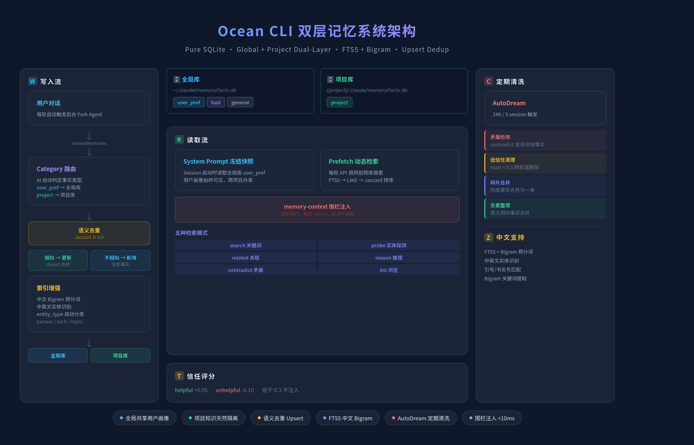

<p align="center">
  
</p>

<div align="center">

**增强版 Claude 命令行工具 — 多模型 · 多记忆 · 多协作**

</div>

<div align="center">

[](LICENSE)
[](README.md)

</div>

<p align="center">
  <a href="#核心功能">功能</a> · <a href="#快速开始">快速开始</a> · <a href="#教程目录">文档</a> · <a href="#架构参考">架构</a>
</p>

---

## 功能

- 完整的 Ink TUI 交互界面（与官方 Claude Code 一致）
- **多模型接入** — Claude / 智谱GLM / 豆包 / DeepSeek，`/model` 一键切换
- **Auto Mode** — AI 分类器自动审批安全操作，危险操作仍需确认
- **双层记忆系统** — 纯 SQLite 结构化事实存储（6 种分类 + 全局/项目双层隔离）+ 自动提取 + 语义去重 + AutoDream 清洗 — [使用指南](docs/tutorial-memory.md)
- **多模型协作** — `/multi-agent` 按角色分工，真实并行调用 — [使用指南](docs/tutorial-multi-agent.md)
- **技能系统** — `/skillify` 从会话提炼技能，支持脚本自动生成 — [使用指南](docs/tutorial-skills.md)
- **Channel IM 集成** — 飞书/钉钉/Telegram 远程控制 Agent — [使用指南](docs/tutorial-channel.md)
- **Hook 系统** — 27 种事件、4 种类型，高度可定制 — [使用指南](docs/tutorial-hooks.md)
- 智能过载重试机制，自动处理 API 限流和超时

---

## 核心功能

### 1. 多模型接入

支持 Anthropic 官方模型和第三方兼容 API，通过 `custom-providers.json` 配置：

```json
{
  "glm": {
    "name": "智谱GLM",
    "type": "anthropic",
    "baseUrl": "https://open.bigmodel.cn/api/anthropic",
    "apiKeyEnv": "YOUR_API_KEY",
    "models": [
      { "id": "glm-5", "name": "GLM-5", "contextLength": 128000 }
    ]
  }
}
```

```bash
# 会话中一键切换
/model glm:glm-5
/model claude-opus-4-6
```

> 内置智能过载重试：API 限流时自动指数退避，无需手动干预。

### 2. Auto Mode

AI 分类器自动审批工具调用，所有模型提供商均可使用：

```bash
# 命令行启用
ocean --permission-mode auto

# 永久启用（~/.claude/settings.json）
{ "permissions": { "defaultMode": "auto" } }
```

### 3. 双层记忆系统

<p align="center">
  
</p>

**核心特性**：
- **双层隔离** — 用户偏好全局共享，项目知识跟随项目，不串台
- **自动提取** — 每轮对话结束，后台 fork agent 自动提取用户偏好、项目结构、技术栈等事实写入 SQLite
- **分层自动注入** — 每轮对话前智能预取相关记忆，identity/workflow/项目概览始终注入，coding_style按技术栈匹配注入，其他记忆按相关性注入，总token占比<2%
- **实体优先去重 + Upsert** — 实体重叠≥50%做主信号，归一化编辑距离做辅助，解决"阈值两难"问题：既不会误合并不同主题事实，也不会漏合同一事实的更新
- **实体自动提取** — 中英文实体识别 + 自动分类（person/technology/topic），基于实体做关联检索和矛盾检测
- **需求变更自动降权** — 同实体下内容冲突时自动降权旧事实，新需求自动覆盖旧设计
- **FTS5 + 中文 bigram** — 写入时预分词，毫秒级本地检索，不依赖 API
- **信任评分机制** — helpful +0.05 / unhelpful -0.10，低信任（<0.5）事实自动排除在注入之外
- **五种高级检索** — search / probe / reason / related / contradict，支持语义搜索、实体关联、冲突检测
- **三层隔离保障** — 路由层内容检测自动纠正分类 + Prompt强制引导 + category白名单，防止项目知识污染全局库

**六种事实分类**：

| Category | 存储位置 | 说明 | 注入策略 |
|---|---|---|---|
| `identity` | 全局库 | 用户身份、称呼偏好、AI角色设定、个人背景 | 始终注入 |
| `coding_style` | 全局库 | 编码规范、命名约定、设计模式偏好（按语言） | 按项目技术栈匹配注入 |
| `tool_pref` | 全局库 | 工具偏好、CLI配置、模型切换习惯 | prefetch 检索注入 |
| `workflow` | 全局库 | 工作流习惯、提交流程、发布偏好、文档处理习惯 | 始终注入 |
| `general` | 全局库 | 跨项目通用偏好、视觉审美、配色偏好 | prefetch 检索注入 |
| `project` | 项目库 | 项目架构决策、实现细节、经验教训、会议记录 | prefetch 检索注入 + 概览始终注入 |

```bash
/mem                    # 列出所有记忆
/mem add 项目架构说明     # 压缩当前对话为记忆
/mem add --full 交接文档  # 完整工作交接（需求+决策+变更+待办）
/mem show mem_001       # 加载全文
/mem search 关键词       # 搜索
/mem rm mem_001         # 删除
```

<details>
<summary>SQLite 表结构详解</summary>

每个数据库包含 3 张核心表 + 1 个 FTS5 虚拟表：

**`facts` — 事实表**
存储所有记忆事实，每条事实独立成行，支持信任评分和检索统计。

| 字段 | 类型 | 说明 |
|------|------|------|
| `fact_id` | INTEGER PK | 自增主键 |
| `content` | TEXT UNIQUE | 事实内容（唯一约束防重复） |
| `category` | TEXT | 分类：identity / coding_style / tool_pref / workflow / project / general |
| `tags` | TEXT | 逗号分隔标签（含中文 bigram 预分词结果） |
| `trust_score` | REAL | 信任评分（0.0~1.0，默认 0.5） |
| `retrieval_count` | INTEGER | 被检索次数 |
| `helpful_count` | INTEGER | 被标记 helpful 次数 |
| `created_at` | TEXT | 创建时间（UTC） |
| `updated_at` | TEXT | 最后更新时间（UTC） |

**`entities` — 实体表**
自动从事实内容中提取的命名实体，支持别名和类型分类。

| 字段 | 类型 | 说明 |
|------|------|------|
| `entity_id` | INTEGER PK | 自增主键 |
| `name` | TEXT | 实体名称 |
| `entity_type` | TEXT | 自动分类：person / technology / topic |
| `aliases` | TEXT | 别名（逗号分隔） |
| `created_at` | TEXT | 创建时间 |

> **entity_type 分类规则**：纯中文 2-4 字 → person（可能是人名），含英文 → technology，中文 5+ 字 → topic

**`fact_entities` — 事实-实体关联表**
多对多关联，一条事实可关联多个实体，一个实体可被多条事实引用。CASCADE 删除保证一致性。

| 字段 | 类型 | 说明 |
|------|------|------|
| `fact_id` | INTEGER FK | 关联 facts.fact_id |
| `entity_id` | INTEGER FK | 关联 entities.entity_id |

> 联合主键 `(fact_id, entity_id)`，INSERT OR IGNORE 防重复关联

**`facts_fts` — FTS5 全文索引（虚拟表）**
绑定 `facts` 表，通过触发器自动同步。支持中文 bigram 分词检索。

| 字段 | 说明 |
|------|------|
| `content` | 同步自 facts.content |
| `tags` | 同步自 facts.tags（含 bigram 预分词） |

> 三个触发器（INSERT/UPDATE/DELETE）保证 FTS5 索引与 facts 表实时同步

</details>

### 4. 多模型协作

配置多个 AI 模型按角色分工，**真实并行调用**：

```bash
# 查看可用模型
/agent-config models

# 用预设创建 agent
/agent-config preset architect --model glm:glm-5.1
/agent-config preset reviewer --model vk:doubao-seed-2.0-pro

# 发起协作任务
/multi-agent 设计一个高并发缓存系统
```

内置 5 个角色预设：架构师、审查员、实现者、测试专家、DevOps。

### 5. 技能系统

从成功的工作流中自动提炼可复用技能：

```bash
# 手动提炼当前会话为技能
/skillify 创建文件并运行验证的工作流
```

**自动提炼**：任务完成后，系统自动检测可复用流程，提示确认后生成完整技能文件：

```
.claude/skills/<name>/
├── SKILL.md          # 技能定义（触发条件、步骤、成功标准）
└── scripts/          # 可执行脚本（数据处理、模板生成等）
    └── process.py
```

### 6. Channel IM 集成

通过 MCP 协议接入 IM 平台，远程控制 Agent：

<p align="center">
  
</p>

```bash
# 启动时绑定
ocean --channels server:feishu

# 会话中动态连接（无需重启）
❯ /feishu                    # 快速连接飞书
❯ /channel connect dingtalk  # 连接钉钉
❯ /channel disconnect feishu  # 断开连接
```

- **入站**：IM 消息 → Agent 接收执行
- **出站**：Agent 结果 → IM 回复
- **权限中继**：工具审批转发到 IM，远程回复 yes/no
- **动态连接**：会话中途 `/feishu` 一键连接，离开后断开

已验证平台：飞书、钉钉

---

## 快速开始

### 一键安装（推荐）

```bash
curl -fsSL https://raw.githubusercontent.com/ArtLjn/ocean-cc-cli/main/install.sh | bash
```

> 脚本会自动安装 Bun、克隆仓库、构建并部署到 `~/.local/bin/ocean`。

### 手动安装

```bash
# 1. 安装 Bun
curl -fsSL https://bun.sh/install | bash

# 2. 克隆并构建
git clone https://github.com/ArtLjn/ocean-cc-cli.git && cd ocean-cc-cli
bun install && ./build.sh
```

### 启动

```bash
ocean                          # 交互 TUI 模式
ocean --permission-mode auto   # Auto Mode
ocean -p "your prompt"         # 无头模式
```

---

## 技术栈

| 类别 | 技术 |
|------|------|
| 运行时 | [Bun](https://bun.sh) |
| 语言 | TypeScript |
| 终端 UI | React + [Ink](https://github.com/vadimdemedes/ink) |
| CLI 解析 | Commander.js |
| API | Anthropic SDK |
| 协议 | MCP, LSP |
| 记忆存储 | SQLite (bun:sqlite) + FTS5（全局+项目双层） |

---

## 项目结构

```
├── src/                    # 主源码
│   ├── agents/             # Agent 实现
│   ├── skills/             # 技能系统
│   │   └── bundled/        # 内置技能（skillify、auto-skillify 等）
│   ├── memory/             # 双层记忆系统（HolographicProvider + 全局/项目 SQLite）
│   ├── providers/          # 模型提供商接入
│   ├── utils/hooks/        # Hook 系统核心
│   └── cli/                # 命令行界面
├── docs/                   # 文档 & 教程
├── static/                 # 静态资源
└── build.sh                # 构建脚本
```

---

## 教程目录

| 教程 | 说明 |
|------|------|
| [快速开始](docs/tutorial-getting-started.md) | 安装、构建、首次使用 |
| [自定义模型接入](docs/tutorial-custom-providers.md) | 智谱GLM/豆包/DeepSeek 配置 |
| [记忆系统](docs/tutorial-memory.md) | 手动记忆 + 自动提取 + AutoDream |
| [多模型协作](docs/tutorial-multi-agent.md) | 角色分工 + 并行调用 |
| [技能系统](docs/tutorial-skills.md) | 技能创建、提炼、脚本生成 |
| [Channel 集成](docs/tutorial-channel.md) | 飞书/钉钉远程控制 |
| [Hook 系统](docs/tutorial-hooks.md) | 事件类型、配置格式、实用示例 |

## 架构参考

| 文档 | 说明 |
|------|------|
| [KAIROS 持久助手](docs/02-kairos.md) | 后台持续运行、自动做梦、Cron 调度 |
| [Coordinator 多 Agent](docs/04-coordinator.md) | 指挥官+执行者编排模式 |
| [Bridge 远程控制](docs/06-bridge.md) | 网页/手机遥控终端 |
| [门控架构](docs/07-feature-gates.md) | 三层门控：编译开关 + USER_TYPE + GrowthBook |
| [Hermes 自学习方案](docs/hermes-caludecode-复用方案.md) | 技能提炼 / 记忆增强 / Observer 用户建模路线图 |

---

## 更新日志

### v1.5.0
- 全局记忆分类细化：从 4 种 category 扩展到 6 种（identity / coding_style / tool_pref / workflow / project / general）
- 分层注入策略：identity/workflow 始终注入，coding_style 按项目技术栈匹配注入，其他走 prefetch
- 语义去重大幅优化：实体优先（≥50% 重叠）+ 归一化编辑距离辅助，彻底解决阈值两难问题
- 分层自动注入：每轮对话前智能预取，identity/workflow/项目概览始终注入，总token占比<2%
- 需求变更自动检测：同实体下内容冲突时自动降权旧事实，新需求自动覆盖旧设计
- 实体提取修复：去掉 bigram 碎片入库，新增中文声明模式提取（"我叫XXX"、"名字是XXX"）
- 孤立实体自动清理：update/remove 事实时自动清理无关联实体
- system prompt 引导 AI 主动操作 fact_store（"记住"时立即写入，update 时保留旧信息）
- 旧数据自动迁移（user_pref/tool → 新 category）

### v1.4.1
- 修复自动记忆提取从未触发（绕过 tengu_passport_quail feature flag）
- 放宽 extractMemories prompt：支持自动提取项目结构、技术栈、目录布局、构建配置
- fact_store 工具 description 改为支持读写，引导 AI 主动存储项目知识

### v1.4.0
- 双层 SQLite 记忆架构：全局库（user_pref/tool/general）+ 项目库（project）
- 去掉 memdir markdown 文件写入，统一为纯 SQLite 存储
- 实体优先去重 + Upsert 机制，共享实体 + 编辑距离判断相似事实自动合并更新
- 中文实体提取：bigram 关键词 + 引号/书名号匹配
- FTS5 中文搜索增强：写入时 bigram 预分词 + 查询时 bigram 拆分
- entity_type 自动分类（person/technology/topic）
- extractMemories forked agent 只写 fact_store，不再写 markdown 文件
- AutoDream 改为 SQLite consolidation（矛盾检测/去重/低信任清理）
- prefetch 简化为纯 SQLite 同步检索（<10ms），去掉 memdir 异步路径

### v1.3.0
- 结构化事实记忆系统（fact_store）：SQLite + FTS5 毫秒级本地检索
- MemoryProvider 插件接口 + MemoryManager 编排器（借鉴 Hermes 架构）
- 五种高级检索：search / probe / related / reason / contradict
- `<memory-context>` 围栏注入 + 安全扫描（注入检测/PII/不可见Unicode）
- 后台审查 Agent 自动提取事实（extractMemories 集成 fact_store）
- 信任评分 + 反馈机制（fact_feedback 工具）

### v1.2.0
- 技能自动提炼（auto-skillify）：Stop hook 检测 + scripts 目录支持
- 移除 skillify 门控，`/skillify` 对所有用户可用

### v1.1.0
- Channel IM 集成（飞书/钉钉）
- 自动记忆提取 + AutoDream 整合
- 修复 Bun 1.3.12 `@` 文件匹配和图片粘贴

### v1.0.0
- 多模型提供商支持（智谱GLM/豆包/DeepSeek）
- Auto Mode 解除全部门控
- `/mem` 轻量记忆系统
- `/multi-agent` 多模型协作
- 海洋深蓝 UI 主题

---

## 许可证

[MIT License](LICENSE) © 2025 ArtLjn

---

<div align="center">

**Ocean CLI — 让 AI 开发更高效，更顺畅**

</div>
