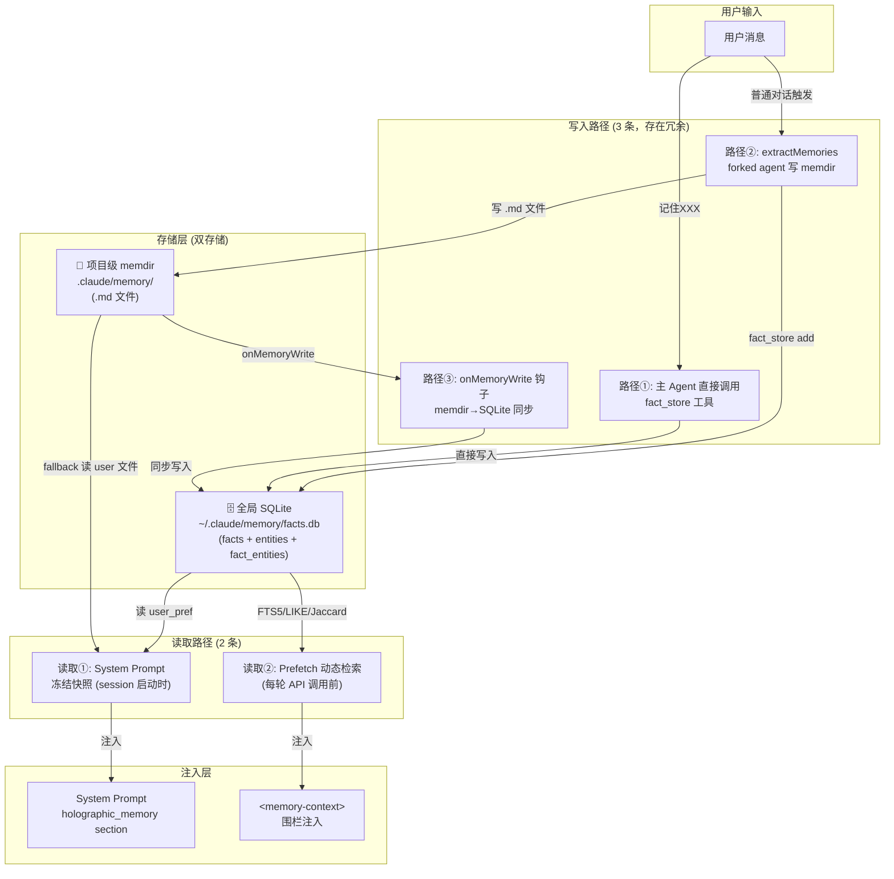
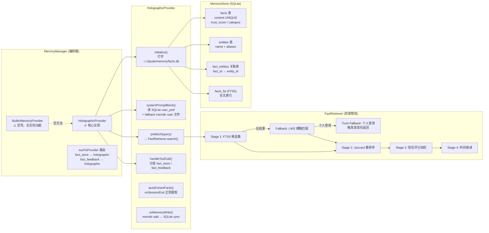
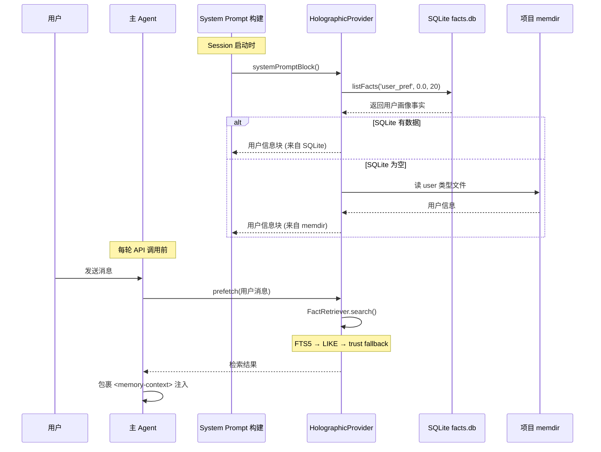
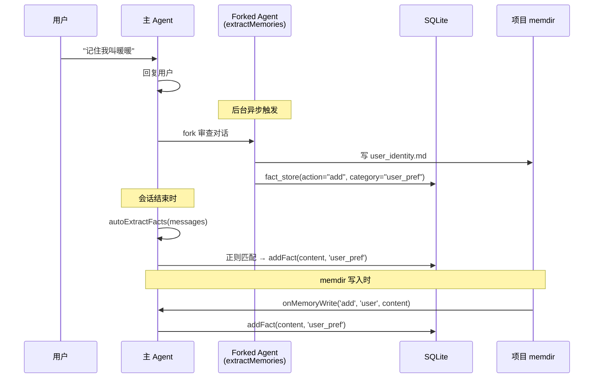

# 当前记忆存储架构图

> 基于 2026-04-25 代码实际状态分析

## 整体数据流架构



## 详细组件关系



## 读取时机详解



## 写入时机详解



---

## 潜在 Bug 分析

### 🔴 Bug 1: 三重写入导致数据冲突

| 路径 | 触发时机 | 写入目标 |
|------|----------|----------|
| extractMemories | 每次后台审查 | memdir + SQLite |
| autoExtractFacts | 会话结束时 | SQLite |
| onMemoryWrite | memdir 写入时 | SQLite |

**问题**: 用户说"记住我叫暖暖"，3 条路径可能同时写入 SQLite 同一内容。虽然 UNIQUE 约束防重复，但 `addFact` 的 UNIQUE 冲突处理有 bug：

```typescript
// MemoryStore.ts:136-137 — 类型转换错误
const row = this.stmtFindFactByContent.get(trimmed)
  as Pick<EntityRow, 'entity_id'> | null  // ❌ 应该是 FactRow
return row
  ? (row as unknown as { fact_id: number }).fact_id ?? Number(...)
  : -1  // ❌ 可能返回 -1 而不是已存在的 ID
```

### 🔴 Bug 2: BuiltinMemoryProvider 空壳浪费

```typescript
// BuiltinMemoryProvider.ts — 所有方法都是空的
// 它注册了但不提供任何功能，占用 provider 槽位
// memdir 的注入完全走旧路径，与 MemoryManager 无关
```

**问题**: memdir 和 MemoryManager 是两套并行系统，没有真正整合。

### 🟡 Bug 3: configHome 传值不一致

```typescript
// prompts.ts:501-504
const manager = getMemoryManager() ?? getMemoryManager({
  sessionId: process.env.SESSION_ID ?? '',
  projectRoot: getCwd(),       // 项目目录
  configHome: getCwd(),        // ❌ 应该是 ~/.claude
})

// 但 HolographicProvider.initialize() 根本不用 ctx.configHome
// 它自己算: process.env.CLAUDE_CONFIG_DIR ?? join(homedir(), '.claude')
```

### 🟡 Bug 4: autoExtractFacts 存原始内容而非匹配结果

```typescript
// HolographicProvider.ts:342
this.store!.addFact(content.slice(0, 400), 'user_pref')
// ❌ 存的是整条消息（最多400字），而非正则匹配的括号内容
// 例如用户说 "帮我写个函数，我叫刘俊男" → 存的是整句话
```

### 🟡 Bug 5: Prefetch 仅对个人查询触发 trust fallback

```typescript
// FactRetriever.ts:371
if (q.length > 10) return false  // 超过10字符不触发
// "我是谁" = 3字符 ✅
// "我的名字是什么" = 7字符 ✅
// "你记得我叫什么名字吗" = 9字符 ✅
// "你能告诉我我的名字是什么吗" = 12字符 ❌ 不触发
```

### 🟡 Bug 6: 实体提取只支持英文模式

```typescript
// MemoryStore.ts:25-28 — 实体提取正则
const RE_CAPITALIZED = /\b([A-Z][a-z]+(?:\s+[A-Z][a-z]+)+)\b/g
// ❌ 中文实体名（如"暖暖"、"刘俊男"）完全无法被提取
// 只有引号包裹的实体才能被识别
```

### 🟢 性能问题: autoExtractFacts 遍历全量消息

```typescript
// HolographicProvider.ts:334-335
for (const msg of messages) {  // 遍历所有消息
  for (const pattern of PREF_PATTERNS) { // 10+ 正则
    pattern.test(content)  // ❌ 对长对话开销大
```

### 🟢 架构冗余: memdir + SQLite 并行

| 特性 | memdir (项目级) | SQLite (全局) |
|------|----------------|---------------|
| 用户画像 | ✅ 但仅限当前项目 | ✅ 跨项目 |
| 项目知识 | ✅ 项目级隔离 | ✅ 但不区分项目 |
| 检索方式 | 文件扫描 | FTS5 + Jaccard |
| 围栏注入 | 通过 MEMORY.md | 通过 `<memory-context>` |
| 去重 | 手动检查 | UNIQUE 约束 |

**问题**: 两套系统存储相同信息，一致性靠 `onMemoryWrite` 单向同步，容易产生数据漂移。
